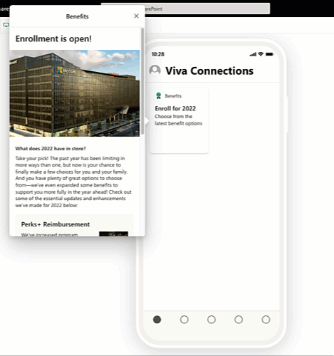
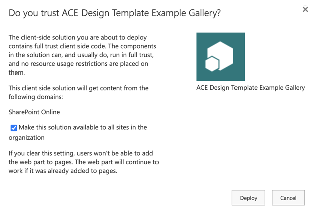
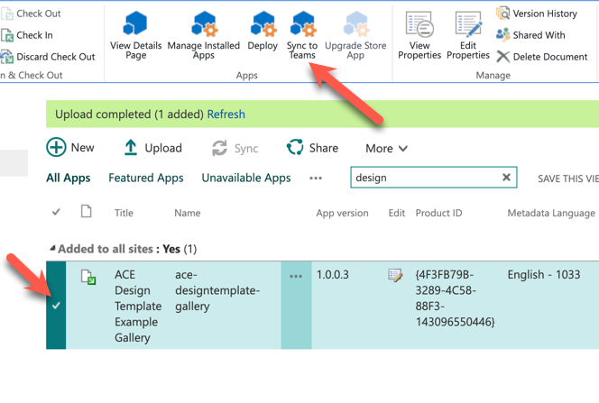
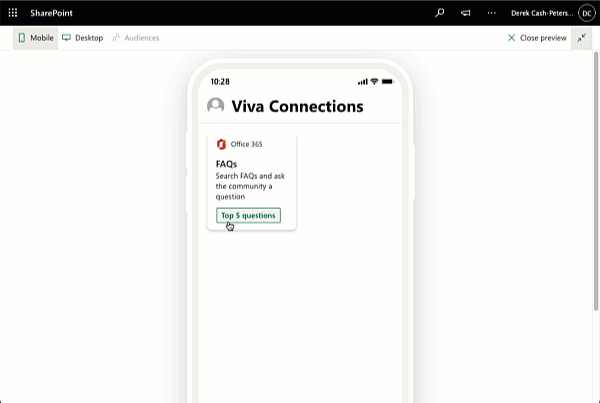
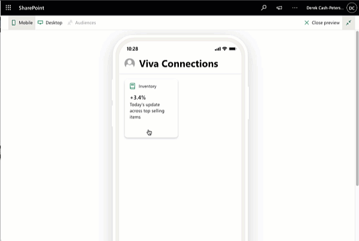
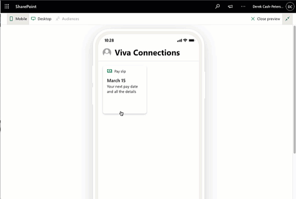
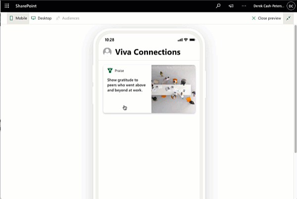
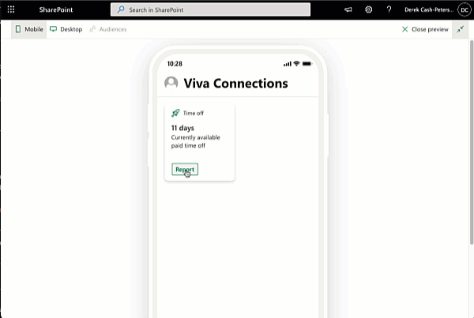

# ace-designtemplate-gallery

## Summary

This solution provides a set of twelve (12) Adaptive Card Extensions to demonstrate different ways to style the quick view with more detailed layouts. They are based on the [Adaptive Card Design Templates](https://github.com/pnp/AdaptiveCards-Templates). There is also a personal app that receives deeps links from many of the samples as well as serves as a gallery of all the different samples.

>This solutions uses mock data but includes a service layer that you can use to make calls to real data sources and a data model you can reference.
>See [Features](#Features) section for individual listing of samples.

## Used SharePoint Framework Version

## Applies to

- [SharePoint Framework](https://aka.ms/spfx)
- [Microsoft 365 tenant](https://docs.microsoft.com/en-us/sharepoint/dev/spfx/set-up-your-developer-tenant)

> Get your own free development tenant by subscribing to [Microsoft 365 developer program](http://aka.ms/o365devprogram)

## Solution

Solution|Author(s)
--------|---------
ace-designtemplate-gallery| Derek Cash-Peterson ([@spdcp](https://twitter.com/spdcp)) Sympraxis Consulting

## Version history

Version|Date|Comments
-------|----|--------
1.0|March 1, 2022|Initial release

## Disclaimer

**THIS CODE IS PROVIDED *AS IS* WITHOUT WARRANTY OF ANY KIND, EITHER EXPRESS OR IMPLIED, INCLUDING ANY IMPLIED WARRANTIES OF FITNESS FOR A PARTICULAR PURPOSE, MERCHANTABILITY, OR NON-INFRINGEMENT.**

---

## Minimal Path to Awesome

### Deploy Default Build

A default solution (sppkg) file for this sample exists in the [deployment](./deployment) folder. This sppkg will need to be deployed in the tenants site collection app catalog with the `Make this solution available to all sites in teh organization` option selected. By doing so the solution will be available in every site collection in the tenant, however since the solution has not been enabled for SharePoint deployment it will not be seen anywhere in the SharePoint user interface. Instead, the Teams manifest that is included in the package will be deployed which creates a Personal App that can then be pinned to the left rail in Teams and, if desired, audience targeted to specific user groups using the [Manage app setup policies in Microsoft Teams](https://docs.microsoft.com/en-us/MicrosoftTeams/teams-app-setup-policies).

#### Steps for deployment

1. Download the SPPKG file, navigate to the [ace-designtemplate-gallery.sppkg](./deployment/ace-designtemplate-gallery.sppkg) file in the [deployment](./deployment) folder of this repository. Select `Download` to save the file to your computer.
1. Upload the sppkg file into the tenant's app catalog by selecting upload, finding the file, and then selecting `OK`.

    

1. A dialog will be displayed asking if you trust the solution. **Make sure you check the `Make this solution available to all sites in teh organization`** check box and then select `Deploy`.

    

1. After the solution has deployed you will need to sync the solution into your Teams app store. To do so, select the solution in the app catalog and then under the files tab in the ribbon the `Sync to Teams` option will be enabled, select it.

    

1. Assuming you received no errors while the solution during the Teams sync, you should now be able to add it into your Teams App Bar as a personal tab. You may want to consider adding the app as a custom pinned site based on the Teams setup policies, you can learn more about doing so by visiting [Manage app setup policies in Microsoft Teams](https://docs.microsoft.com/en-us/MicrosoftTeams/teams-app-setup-policies). Further, for more information on changing the permissions on who has access to the app, you can read more [View app permissions and grant admin consent in the Microsoft Teams admin center](https://docs.microsoft.com/en-us/microsoftteams/app-permissions-admin-center).

## Features

Based on the samples provided by the [Adaptive Card Templates](https://github.com/pnp/AdaptiveCards-Templates), these samples help demonstrate the functionality of the Adaptive Card extensions and designed QuickViews. The solution contains the following examples:

- Benefits
Highlights details of information with click through links into the Teams Personal App.

- Events
Showcases an event timeline with multiple days. Shows how to create tabs with listings of information. Registration form with deep link into teams.

- FAQ Accordion
FAQ style layout with accordions show and hide capability. Submitting a question deep links to Teams Personal App.

- Image Carousel
Image carousel with dynamic images shows spacing for product specifications. Shows data binding and image rendering.

- Inventory Details
Provides list of inventory data as well as conditional formatting based on data values. Deep links into Teams Personal App

- Payslip
Show payslip information for salary and tax information. highlights how to create dynamic date ranges and navigation buttons to update ranges.

- Praise
Image card showing different ways to lay out list data. In this example we use an image of people as well as deep linking into Teams Personal App.

- Team Calendar
Shows time off and items due for a team. Dynamically created calendar with month to month paging.

- Holiday Timeline
Shows US holiday data in a vertical pattern with imagery.

- Vacation/Time-off
Shows employees the amount of time off they have in a given period and a form to allow for scheduling of time off requests. Submitting the form links to Teams Personal App.

- Vaccination Booster Schedule
Allows users to schedule vaccine or booster appointments. Provides information around booster shots and a form to facilitate scheduling. Submitting the form links to the Teams Personal App.

- Visual List
Cafeteria menu showcasing how to layout data visually with images. Provides tabbed interface. Shows how to work with a single array of data and split the array based on different attributes.

## References

- [Extend Microsoft Viva Connections Learn Path](https://aka.ms/m365/dev/learn/connections)
- [Getting started with SharePoint Framework](https://docs.microsoft.com/en-us/sharepoint/dev/spfx/set-up-your-developer-tenant)
- [Building for Microsoft teams](https://docs.microsoft.com/en-us/sharepoint/dev/spfx/build-for-teams-overview)
- [Use Microsoft Graph in your solution](https://docs.microsoft.com/en-us/sharepoint/dev/spfx/web-parts/get-started/using-microsoft-graph-apis)
- [Publish SharePoint Framework applications to the Marketplace](https://docs.microsoft.com/en-us/sharepoint/dev/spfx/publish-to-marketplace-overview)
- [Microsoft 365 Patterns and Practices](https://aka.ms/m365pnp) - Guidance, tooling, samples and open-source controls for your Microsoft 365 development

